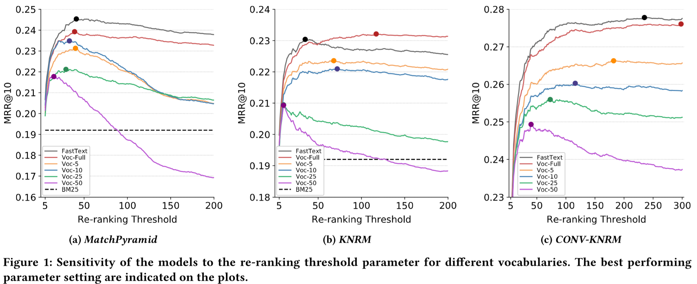

# On the Effect of Low-Frequency Terms on Neural-IR Models 

*SIGIR’19, Sebastian Hofstätter, Navid Rekabsaz, Carsten Eickhoff, and Allan Hanbury*

Low-frequency terms are a recurring challenge for information retrieval models, especially neural IR frameworks struggle with adequately capturing infrequently observed words. While these terms are often removed from neural models - mainly as a concession to efficiency demands - they traditionally play an important role in the performance of IR models. In this paper, we analyze the effects of low-frequency terms on the performance and robustness of neural IR models. We conduct controlled experiments on three recent neural IR models, trained on a large-scale passage retrieval collection. We evaluate the neural IR models with various vocabulary sizes for their respective word embeddings, considering different levels of constraints on the available GPU memory. 

We observe that despite the significant benefits of using larger vocabularies, the performance gap between the vocabularies can be, to a great extent, mitigated by extensive tuning of a related parameter: the number of documents to re-rank. We further investigate the use of subword-token embedding models, and in particular FastText, for neural IR models. Our experiments show that using FastText brings slight improvements to the overall performance of the neural IR models in comparison to models trained on the full vocabulary, while the improvement becomes much more pronounced for queries containing low-frequency terms. 



**Get the full paper here: http://arxiv.org/abs/1904.12683**

**Please cite the paper:**

```
@inproceedings{hofstaetter_sigir_2019,
    author = {Hofst{\"a}tter, Sebastian and Rekabsaz, Navid and Eickhoff, Carsten and Hanbury, Allan},
    title = {On the Effect of Low-Frequency Terms on Neural-IR Models},
    booktitle = {Proceedings of SIGIR},
    year = {2019},
    publisher = {ACM}
}
```

*If you have any questions or suggestions, please feel free to open an issue or write an email to Sebastian (email in the paper). Of course we are also open future collaborations in the field of neural IR *

## Implemented models

Thanks to all the original authors for their inspiring papers! - We re-implemented the following models:

* **KNRM**: Chenyan Xiong, Zhuyun Dai, Jamie Callan, Zhiyuan Liu, and Russell Power. 2017. End-to-End Neural Ad-hoc Ranking with Kernel Pooling. In Proc. of SIGIR.
* **Conv-KNRM**: Zhuyun Dai, Chenyan Xiong, Jamie Callan, and Zhiyuan Liu. 2018. Convolutional Neural Networks for Soft-Matching N-Grams in Ad-hoc Search. In Proc. of WSDM
* **MatchPyramid**: Liang Pang, Yanyan Lan, Jiafeng Guo, Jun Xu, Shengxian Wan, and Xueqi Cheng. 2016. Text Matching as Image Recognition. In Proc of. AAAI.

We show that all three models work really well with the MS MARCO test collection - if implemented and tuned correctly. 

## Implementation: General ideas & setup

Requirements: PyTorch 1.0+ and AllenNLP

* For re-ranking depth evaluation you need BM25 ranks (We recommend using [Anserini](https://github.com/castorini/anserini) to generate them)

* train.py is the main trainer -> it uses a multiprocess batch generation pipeline
* the multiprocess pipeline requires us to do some preprocessing:
    1. pre-tokenize the training & eval files (because we want the spacy tokenizer, but it is just to slow)
    2. split the files with preprocessing/generate_file_split.sh (so that each loader process gets its own file and does not need to coordinate)

## How to train the models

1. Get the [MS MARCO re-ranking dataset](http://www.msmarco.org/dataset.aspx) & clone this repository
2. Prepare the dataset for training (with costly spacy tokenizer)
    * Run ``python matchmaker/preprocessing/tokenize_files.py --in-file <path> --out-file <path> --reader-type <labeled_tuple or triple>``
      to save a tokenized version of the training and evaluation files (now we can use the much faster space only tokenizer when reading the files, but we have to benefits of the quality tokenization of spacy)
2. Prepare the dataset for multiprocessing:
    * Use ``./generate_file_split.sh`` 1x for training.tsv and 1x for top1000dev.tsv (the validation set)
    * You have to decide now on the number of data preparation processes you want to use for training and validation
    * You have to decide on the batch size 
    * Run ``./generate_file_split.sh <base_file> <n file chunks> <output_folder_and_prefix> <batch_size>`` for train + validation sets
    * Take the number of batches that are output at the end of the script and put them in your config .yaml
    * The number of processes for preprocessing depends on your local hardware, the preprocesses need to be faster at generating the batches then the gpu at computing the results for them (validation is much faster than training, so you need more processes)
3. Create a new config .yaml in configs/ with all your local paths + batch counts for train and validation
    * The train and validation paths should be the output folder of 2 with a star at the end (the paths will be globed to get all files)`
4. Create an AllenNLP vocabulary with preprocessing/generate_vocab.py, optional for re-ranking threshold evaluation: create new validation tuples that exactly match the bm25 results from anserini with preprocessing/generate_validation_input_from_candidate_set.py
5. Run ``train.py`` with ``python -W ignore train.py --run-name experiment1 --config-file configs/your_file.yaml`` (-W ignore = ignores useless spacy import warnings, that come up for every subprocess (and there are many of them))
